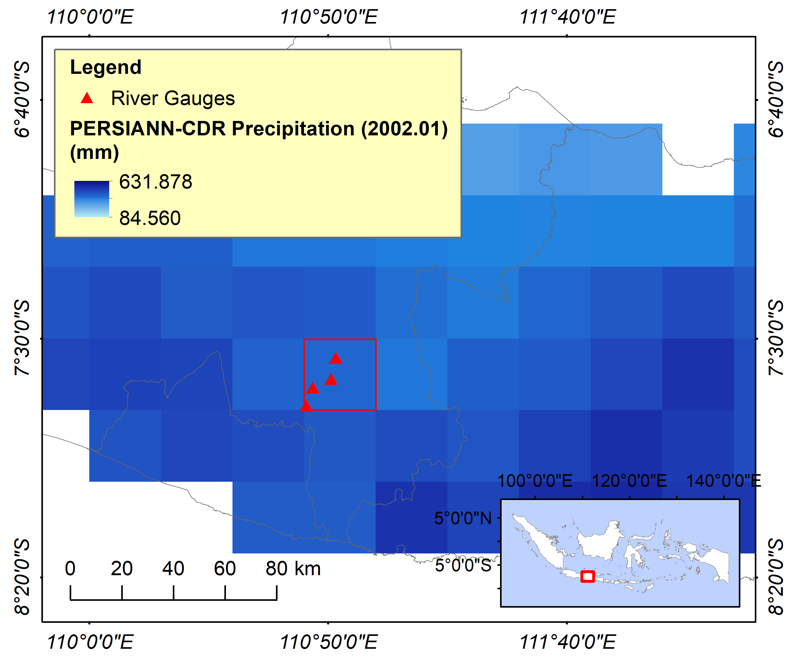
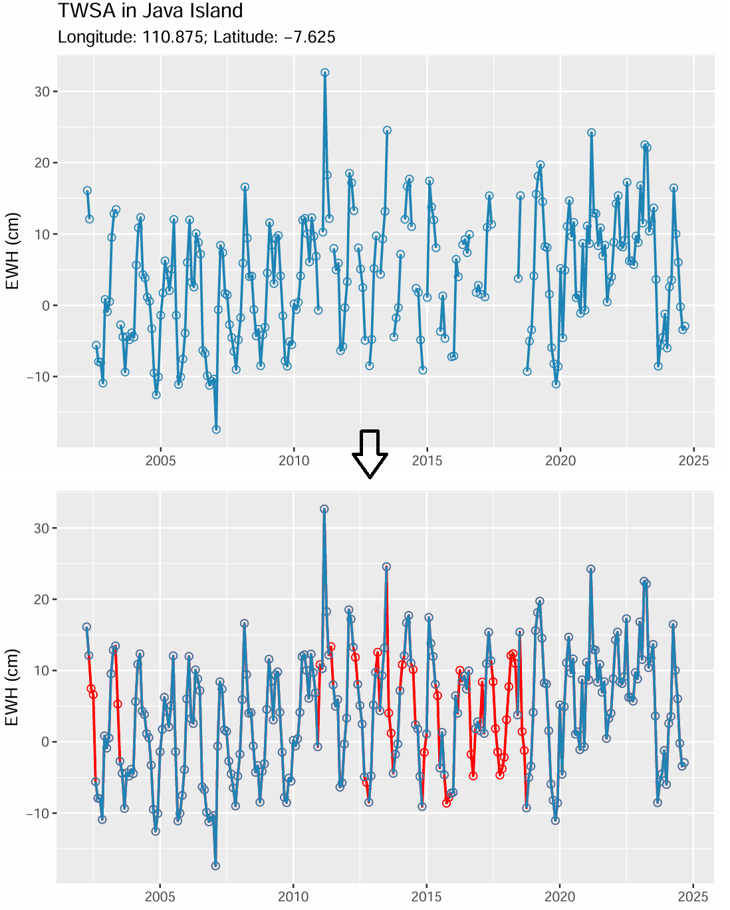

# Applying STLplus to GRACE Terrestrial Water Storage Data
This notebook aims to apply STLplus to GRACE/GRACE-FO Terrestrial Water Storage Anomaly (TWSA) data from [CSR (Center for Space Research)](https://www2.csr.utexas.edu/grace/RL06_mascons.html) with a 0.25-degree spatial resolution and a one-month temporal resolution. STLplus is an improved decomposition approach of seasonal and trend decomposition using Loess (STL) by [Cleveland et al. (2019)](https://www.wessa.net/download/stl.pdf), developed by [**Ryan Hafen**](https://github.com/hafen/stlplus).

STLplus decomposes signals into trend, seasonal, and remainder constituents with a better treatment of missing values. Therefore, it can handle intra-gaps (within the GRACE mission from 2002.04 to 2017.05) and continuous inter-gaps (11 gap months between GRACE and GRACE-FO missions from 2017.06 to 2018.05) of GRACE TWSA data, with notable findings from previous studies ([Arshad et al., 2024](https://agupubs.onlinelibrary.wiley.com/doi/10.1029/2023WR035882); [Ali et al., 2024](https://doi.org/10.1016/j.scitotenv.2023.168239); [Khorrami et al., 2023)](https://onlinelibrary.wiley.com/doi/10.1002/hyp.14893). We fill the missing TWSA values with the decomposed trend of TWSA and then add the average seasonal and residual components for the respective months.

Since we conduct a straightforward analysis, we will only select one grid data from GRACE CSR, with a latitude of -7.625 and a longitude of 110.875, located in Java Island of Indonesia. This selection is based on the availability of four river gauge observation data (the distribution is shown in the figure below, source: _Layanan Informasi dan Data Sumber Daya Air (LISDA) Balai Besar Wilayah Sungai Bengawan Solo_) to validate our decomposition results.

Code reference: [Harrington (2020)](https://www.mattrharrington.com/post/fill-in-missing-cyclical-data-using-seasonal-trend-loess-and-cross-validation).

## Results

### Reference

-   Ali, S., Ran, J., Luan, Y., Khorrami, B., Xiao, Y., & Tangdamrongsub, N. (2024). The GWR model-based regional downscaling of GRACE/GRACE-FO derived groundwater storage to investigate local-scale variations in the North China Plain. Science of The Total Environment, 908, 168239. <https://doi.org/10.1016/j.scitotenv.2023.168239>.

-   Arshad, A., Mirchi, A., Taghvaeian, S., & AghaKouchak, A. (2024). Downscaled‐GRACE data reveal anthropogenic and climate‐induced water storage decline across the Indus Basin. Water Resources Research, 60(7), e2023WR035882. <https://doi.org/10.1029/2023WR035882.>

-   Cleveland, R. B., Cleveland, W. S., McRae, J. E., & Terpenning, I. (1990). STL: A seasonal-trend decomposition. J. off. Stat, 6(1), 3-73.

-   Hafen, R. stlplus. GitHub. Available at: <https://github.com/hafen/stlplus>.

-   Harrington, M. (2020). Fill in Missing Cyclical Data using STL and Cross Validation. Available at: <https://www.mattrharrington.com/post/fill-in-missing-cyclical-data-using-seasonal-trend-loess-and-cross-validation>.

-   Khorrami, B., Ali, S., Sahin, O. G., & Gunduz, O. (2023). Model‐coupled GRACE‐based analysis of hydrological dynamics of drying Lake Urmia and its basin. Hydrological Processes, 37(5), e14893. <https://doi.org/10.1002/hyp.14893.>

### Contact
For suggestions and collaboration, kindly reach me at: [LinkedIn](https://www.linkedin.com/in/rizka-amelia-dwi-safira/) or rizkasafira20@gmail.com.

